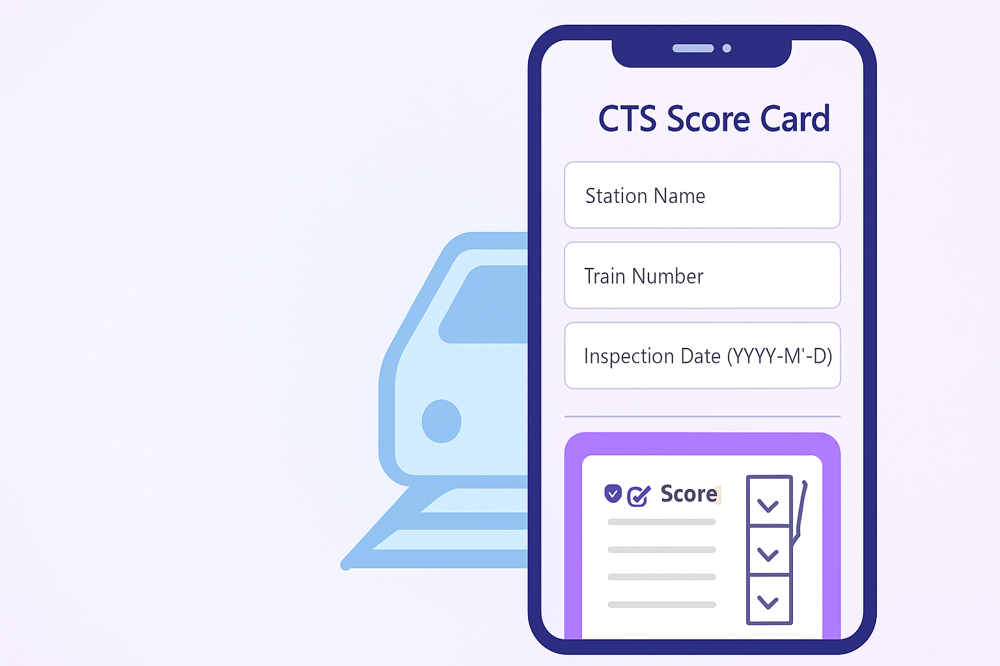

# 🚄 CTS Digital Score Card App 📱

A Flutter-based mobile application to digitize the Clean Train Station (CTS) inspection process by capturing coach-wise cleanliness scores and remarks in a structured, modern, and intuitive mobile interface.

---


## 📋 CTS Digital Score Card — Features List

### 📱 UI & User Experience:

* Modern, clean, mobile-friendly Flutter interface
* Centralized title bars for all screens
* Colored, rounded **Coach Cards** and **Section Containers** for easy visual grouping
* Dynamic **Add Coach** button to add new coach sections
* Coach cards with delete icons for easy removal
* Form fields with outlined borders and proper spacing

---

### 📄 Form Features:

* Inputs for:

  * **Station Name**
  * **Train Number**
  * **Inspection Date (YYYY-MM-DD)**
* Coach-wise cleanliness score inputs:

  * **T1, T2, D1, D2**
* Dynamic addition/removal of coaches and sections

---

### ✅ Validations:

* Required validation for Station Name, Train Number, and Date
* Train Number must be numeric
* Inspection Date must follow **YYYY-MM-DD** format
* AlertDialog popup if validation fails, preventing accidental incomplete submission

---

### 📊 Summary Review:

* Full review screen before final submission
* Display of all entered data in clean, card-based layout
* Coach-wise section scores shown clearly

---

### 📤 Data Submission:

* Data submitted to a mock API endpoint via `ApiService`
* Success confirmation dialog with green check icon on successful submission
* Form reset after successful submission

---

### 🔄 Form Reset:

* **Clear Form** button to manually reset all fields and coach data instantly
* Snackbar notification on clear action

---

### 📦 State Management:

* Managed with **Provider** for clean, reactive state updates across screens

---

## 📌 Optional Enhancements (Proposed)

* Date picker for selecting Inspection Date
* Persistent local or cloud storage
* PDF export of the summary
* Network failure handling

---


---

## 📂 Project Structure

```

lib/
├── main.dart
├── providers/
│    └── form\_provider.dart
├── screens/
│    └── score\_card\_form\_screen.dart
│    └── summary\_screen.dart
├── services/
│    └── api\_service.dart
├── widgets/
│    └── score\_input\_widget.dart

```

---

## 🚀 How to Run

1. Ensure Flutter SDK is installed.
2. Clone the repository.
3. Run `flutter pub get` to fetch dependencies.
4. Run `flutter run` on a connected device or emulator.

---

## 📸 Screenshots

> (You can attach screenshots or a screen recording link here)

---

## 📹 Demo Videos

- 📱 [**UI Demo Video**](https://drive.google.com/file/d/1guim1DXgueIAM-oyruUc07uWCjPQlvi3/view?usp=sharing)
- 📝 [**Technical Walkthrough**](https://drive.google.com/file/d/1gRhAWT6_W-D0KKu1ywgJHl8ERmcSx6S-/view?usp=sharing)

*(Replace these links with your own)*

---

## 📌 Assumptions & Limitations

- No persistent local or cloud storage — data is submitted via a mock API.
- Offline caching not implemented.
- No PDF export feature (optional enhancement idea).

---


## 🙌 Developed By

**Pratik Pattanayak**  


---

